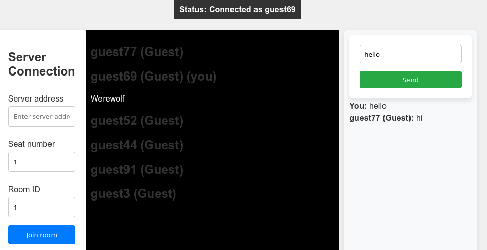

# GameAwesome
A Python game engine.

Or more precisely, a framework for multiplayer board games (work in progress). You implement a game in straightforward Python e.g. like this:

```python
...
class Werewolf(Role):
    ALLEGIANCE = Team.WEREWOLVES

    @classmethod
    def wake_up(cls, game: Werewolves, players: list[Player]):
        game.werewolf_kill = None
        with game.chat(players) as chat:
            votes = collect_votes(players, game, message="Vote who your Werewolf pack should kill")
            votes = count_votes(votes)
            game.werewolf_kill = get_top_vote(votes)
...
```

...the framework takes care of networking, client connections, synchronization of game state etc. and you end up with an (admittedly ugly) playable front-end like this:



# Usage
```sh
python examples/run_server.py
```

Note: this requires (at least) Python 3.11.
